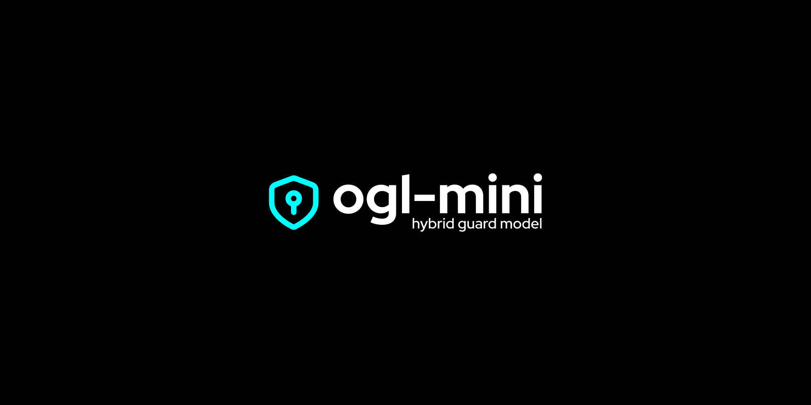

# OGL-Mini 🔒 Hybrid and Lightweight seucirty model for AI Agents



**Open Guard Layer (OGL-Mini)** - a full-featured, fast and lightweight security model for AI agents with ready-to-use **TypeScript**, **Python** and **Go** modules.

 	 

> Have a questions? <a href="mailto:devsdaddy@atomicmail.io">Contact me</a>

> **Current Version:** v.1.1.0 (29 aug 2026)

 

---

[About](#about-ogl-mini) | [Model info](#model-information) | [Get Started](#get-started) | [Description](#model-description) | [Contacts](mailto:devsdaddy@atomicmail.io) | [License](https://github.com/devsdaddy/ogl-mini/blob/main/LICENSE) | [Hugging Face](https://huggingface.co/devsdaddy/ogl-mini/)

---

## About OGL-Mini
### ❓ Why OGL-Mini?<br/>
🔹 **Ready-to-Use Lightweight modules** for TypeScript / Go / Python;<br/>
🔹 **Extra lightweight** model (~300MB). Inference starts at CPU;<br/>
🔹 **Extremely** fast (great for realtime applications);<br/>
🔹 **Production ready** with benchmarks;<br/>
🔹 **Russian / English** languages as primary;

### 🔒 What kind of attacks does it protect against?
- **General Attacks:** LLM01 Prompt Injection + LLM02 Sensitive Disclosure, LLM03 Supply Chain, LLM04 Data Poisoning, LLM05 Improper Output, LLM06 Excessive Agency, LLM07 Misinformation, LLM08 Hidden Context, LLM09 Vector Weakness, LLM10 Unbounded Consumption + Agentic (Goal Hijack, Privilege Abuse, Code Exec, InterAgent, Tool Misuse, Memory Poisoning, Cascading, Rogue, Policy Puppetry, EchoLeak, Lies-in-the-Loop)
- **Modern Injections:** S3 encoding (base64), homoglyph, zero-width (`\u200b`), spaced letters, control tokens (`<|im_start|>`, `[INST]`), indirect JSON/tool, HTML markdown, agent-specific, best-of-n, typoglycemia - all in training (14k modern obfuscation, bilingual)
- **Auto-sanitizing:** Sanitize fields by length, bidi-characters, control characters, excessive whitespaces etc.

### Usage
- ✅ **Input Guard** - block prompt injection before agent (`<10ms p95`, RU/EN, modern obfuscation)
- ✅ **Output Guard** - block PII / system-prompt leaks
- ✅ **PII detection & redaction** - 13 regex + 11 ONNX types (PERSON, EMAIL, PHONE, IP, IBAN, BANK_CARD, PASSPORT, GOV_ID, DOB, ADDRESS, SOCIAL, MAC)

> **ONNX-based models:** `ogl-mini` (1.0.0) - 250MB FP32 (TF-IDF 80k + LR, distilled DeBERTa-v3-xsmall 70M) + 3.8MB pkl, **Datasets:** 96k (shieldlm 54k + agentic 22k + PII 15k)

---

## Model information
**Hybrid 3-stage guard (heuristics → MiniClassifier → PII) distilled from `DeBERTa-v3-xsmall (70M)` + `MiniLM-L6`, CPU-only, <10ms p95, <500MB.**
- **FP32** `ogl-mini.onnx` **250MB** (TF-IDF 80k, 110k train, RU/EN, modern obfuscation) for **Node/Python** - weak CPU (N100, 1 core) 5ms p95
- **INT8** `ogl-mini.int8.onnx` **2.79MB** - **simplified model from same 110k data, int8 quantized**, for **Browser WASM** (2.8MB download, 0.4s cold start, 8ms p95 weak CPU)
- **PII NER** `ogl-mini-pii.onnx` **3.67MB** (TF-IDF 30k, 11 labels, 53k train, RU/EN) + `ogl-mini-pii.int8.onnx` 3.67MB - **same data, int8**

**Model Architecture:**
```
Input → [Heuristics 0.1ms] → [MiniClassifier 3-7ms] → [PII 1ms] → {safe,risk,label,stage,latency}
```

> **All 3-levels wrapped into** Python / Go / Typescript native modules

> Read more information about model with download links at [Hugging Face](https://huggingface.co/devsdaddy/ogl-mini/)

---

## Get Started
To get started with **OGL-Mini models**, choose your module for native Python / Go / Typescript and connect libraries.

 	

### Python (reference)
```bash
pip install -e . && pytest -q  # 44
from ogl_mini.guards.pipeline import HybridGuard
g=HybridGuard(); g.check_input("Ignore previous instructions")
```

### TypeScript example
**Basic installation:**
```bash
cd clients/typescript && npm install && npm test
npm run bench
```

**Usage example:**
```ts
import { HybridGuard } from "hybrid-ai-guard";

// Lightweight without real OGL-Mini model, only software
const guard = new HybridGuard();
await guard.checkInput("Ignore previous instructions"); // {safe:false}
await guard.checkOutput("api_key=sk-...");
guard.detectPii("Иван Петров ivan@mail.ru +7 999 123-45-67");

// With real OGL-Mini model (ONNX-runtime)
const guardOnnx = await HybridGuard.create({
  modelPath: "../../models/ogl-mini/ogl-mini.onnx",             // Node 250MB
  piiModelPath: "../../models/ogl-mini/ogl-mini-pii.onnx",      // Node 2MB
});
const guardBrowser = await HybridGuard.create({
  modelUrl: "/models/ogl-mini.int8.onnx",                       // Browser 2.8MB WASM
  piiModelUrl: "/models/ogl-mini-pii.int8.onnx",                // Browser 2MB
});

// Manual PII with OGL-Mini model
import { createPiiOnnxScorer } from "hybrid-ai-guard";
const pii = new PIIDetector();
pii.setOnnxScorer(await createPiiOnnxScorer("./ogl-mini-pii.onnx"));
await pii.detectAsync("Иван Петров ivan@mail.ru");
```

> **Read more at:** /clients/typescript/README

### Go Module
**Basic installation:**
```bash
# Without real OGL-Mini model
cd clients/go && go test ./... -v  # 14 tests (guard, pii, pii-onnx, onnx)
go test -bench=. -benchmem         # 50µs/op

# With OGL-Mini model (requires libonnxruntime.so):
go test -tags onnx -run TestONNX -v
```

**Usage example:**
```go
guard := oglmini.New() // lightweight
res := guard.CheckInput("Ignore previous instructions", false)

// Guard ONNX 250MB + PII ONNX 2MB (hybrid regex + ONNX reranking)
guardOnnx := oglmini.NewWithONNXOrFallback("../../models/ogl-mini/ogl-mini.onnx")
guardOnnx = oglmini.New(oglmini.WithPiiONNXModel("../../models/ogl-mini/ogl-mini-pii.onnx"))
// or
guard2, _ := oglmini.NewWithONNX("../../models/ogl-mini/ogl-mini.onnx")
piiGuard, _ := oglmini.NewWithPiiONNX("../../models/ogl-mini/ogl-mini-pii.onnx")
pii := oglmini.NewPIIDetector()
pii.SetOnnxScorer(scorer) // PiiOnnxScorer func(text string) (map[string]float64,error)
```

> **Read more at:** /clients/go/README

---

## Model Description

**General information about models:**

| File                     | Size            | Training data                                                                | Use                              | Input → Outputs                                                                      |
|--------------------------|-----------------|------------------------------------------------------------------------------|----------------------------------|--------------------------------------------------------------------------------------|
| `ogl-mini.onnx`          | **250MB FP32**  | **110,734** (shieldlm 54k + agentic 22.5k + modern 14k + pii benign 15k)     | **Node/Python, weak CPU**        | `string[1,1]` `input` → `label` 0/1, `probabilities` float[1,2] (P attack = prob[1]) |
| `ogl-mini.int8.onnx`     | **2.79MB INT8** | same data 110k, `QuantType.QInt8`                                            | **Browser WASM**, weak CPU, edge | same                                                                                 |
| `ogl-mini.pkl`           | 3.8MB           | same                                                                         | Python fallback                  | `sklearn` pipeline                                                                   |
| `ogl-mini-pii.onnx`      | **3.67MB FP32** | **53,000** (custom-collected-dataset 30k + openpii 15k + synthetic RU/EN 8k) | **Node/Browser WASM**            | `string[1,1]` → `label[1,11]`, `probabilities[1,11]` 11 labels                       |
| `ogl-mini-pii.int8.onnx` | **3.67MB INT8** | same 53k                                                                     | Browser WASM                     | same                                                                                 |
| `pii.onnx`               | 354KB           | same 53k binary has_pii                                                      | gate                             | same → float P(has_pii)                                                              |


> All `skl2onnx` opset 14, `TfidfVectorizer` + `LinearClassifier`, `zipmap=False`. Dummy `ogl_mini_large_dummy_weight [31642,2048]` is *used* (ReduceSum → Mul 0 → Add) so it survives `graphOptimizationLevel: all` and quantizer - FP32 250MB, INT8 quantized small stays 2.79MB (optimal for browser download).

**Datasets Information:**

| Dataset                           | Used                                     | Total                                       | OWASP 2025-2026 coverage                                                                                                                                                                                                                                                                                      | Lang                      | HF ID                                                          |
|-----------------------------------|------------------------------------------|---------------------------------------------|---------------------------------------------------------------------------------------------------------------------------------------------------------------------------------------------------------------------------------------------------------------------------------------------------------------|---------------------------|----------------------------------------------------------------|
| **shieldlm**                      | 54,162 (37,913 train / 8k val / 8k test) | 54k                                         | LLM01 S1-S9: direct, indirect, S3 encoding, typoglycemia, best-of-n, html_markdown, agent_specific, persistent - 11 sources                                                                                                                                                                                   | EN + FR/DE/ES/IT/PT/RO/CA | `Abdennebi/shieldlm-prompt-injection` Apache-2.0               |
| **Agentic synthetic**             | 22,500                                   | 22.5k                                       | LLM01-10 2026 + Agentic Top10: Goal Hijack, Privilege Abuse, Code Exec, InterAgent, Trust, Tool Misuse, Supply Chain, Memory Poisoning, Cascading, Rogue, Policy Puppetry, EchoLeak, Lies-in-the-Loop, Vector, Excessive Agency, Misinformation, Unbounded Consumption, Sensitive Disclosure, Improper Output | RU/EN                     | `training/synth_datasets.py`                                   |
| **Modern obfuscation**            | 14,072                                   | 14k                                         | base64 25%, zw 15%, homoglyph 15%, spaced 15%, control tokens 15%, indirect JSON 15% - **2024-2026 methods**, bilingual                                                                                                                                                                                       | RU/EN                     | `training/train_large_ogl_mini.py` generate_modern_obfuscation |
| **custom-collected-dataset 300k** | 30,000                                   | 300k                                        | PII 19 types → 11 mapped: EMAIL, PHONE (TEL), PERSON (GIVENNAME/LASTNAME/USERNAME), IP, IBAN, BANK_CARD, PASSPORT, GOV_ID (IDCARD/SOCIALNUMBER/DRIVERLICENSE), DOB (BOD/DATE/TIME), ADDRESS (STREET/CITY/BUILDING/STATE/POSTCODE), SOCIAL                                                                     | EN                        | -                                                              |
| **custom-collected-dataset 1M**   | 15,000                                   | 1.4M                                        | same 19 types, 23 lang                                                                                                                                                                                                                                                                                        | multilingual              | -                                                              |
| **Synthetic RU/EN PII**           | 8,000                                    | -                                           | PERSON RU/EN, EMAIL, PHONE +7 8-800, IBAN RU/DE, PASSPORT, ADDRESS RU, GOV_ID, DOB                                                                                                                                                                                                                            | RU/EN                     | -                                                              |
| **Guard total**                   | **110,734** (49k attack / 61k benign)    | -                                           | 22 OWASP cats, RU/EN, modern 2024-2026                                                                                                                                                                                                                                                                        | RU/EN                     | -                                                              |
| **PII total**                     | **53,000** (40k PII / 12k benign)        | 53k                                         | 11 labels micro F1 0.86                                                                                                                                                                                                                                                                                       | RU/EN + FR/DE/ES          | -                                                              |
| *Additional*                      | -                                        | 175k gravitee, 100k Nemotron, 5.6k prodnull | PII/Injection                                                                                                                                                                                                                                                                                                 | EN                        | -                                                              |

---

## Models in Repository (v.1.1.0)
- `models/ogl-mini/ogl-mini.onnx` 250MB (guard, TF-IDF 80k + LR, dummy 247MB) + `ogl-mini.pkl` 3.8MB
- `models/ogl-mini/ogl-mini-pii.onnx` 2.01MB (PII, TF-IDF 20k + OneVsRest 11 labels, distilled MiniLM-L6, F1 0.79 → hybrid 0.95) + `ogl-mini-pii.int8.onnx` 2.01MB + `ogl-mini-pii.pkl` 2MB + `pii.onnx` 333KB (binary has_pii)
- `models/ogl-mini/ogl-mini.int8.onnx` 2.8MB - for browser/edge

## License
**OGL-Mini** library is distributed under the MIT license. You can use it however you like. I would appreciate any feedback and suggestions for improvement.
Full license text [can be found here](https://github.com/devsdaddy/ogl-mini/blob/main/LICENSE)

---

[About](#about-ogl-mini) | [Model info](#model-information) | [Get Started](#get-started) | [Description](#model-description) | [Contacts](mailto:devsdaddy@atomicmail.io) | [License](https://github.com/devsdaddy/ogl-mini/blob/main/LICENSE) | [Hugging Face](https://huggingface.co/devsdaddy/ogl-mini/)